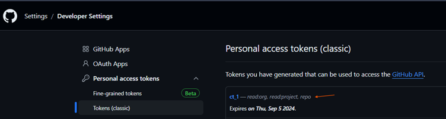
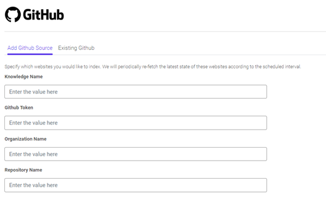

# GitHub Connector User Documentation

## Create a GitHub PAT (Classic)
1. Navigate to the top-right corner and click on your profile photo.
2. Click on **Settings**.
3. Go to **Developer settings** from the left-hand side panel.
4. Click on **Personal access tokens**, and then **Tokens (classic)**.
5. Click on **Generate new token**, and then select **Generate new token (classic)** from the dropdown.

Please provide the following minimal permissions while generating the token.

## User Guide
1. Provide any name for the knowledge.
2. Enter the GitHub token you generated.
3. If the repository falls under any organization, then provide the name of the organization. Otherwise, leave it blank.
4. Enter the desired repository.
5. If the repository is your personal repository and doesn't fall under any organization, then enter the path of the repository eg. "userID/repository_name"

