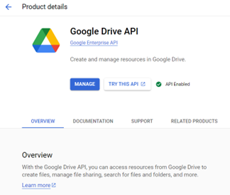
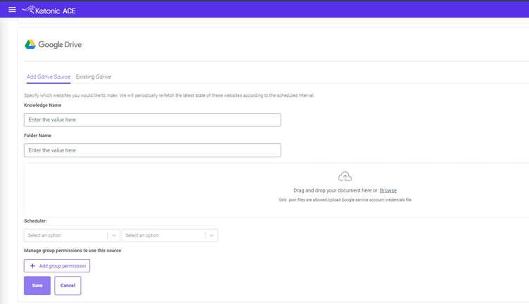

# Google Drive Connector User Documentation

## Overview
The Google Drive Connector is a versatile tool designed to facilitate seamless access to your Google Drive files and folders. With just a few inputs, this connector allows you to quickly retrieve, organize, and manage your Google Drive content. Whether you’re dealing with documents, spreadsheets, PPTs or any other file type, the Google Drive Connector ensures you have easy and structured access to your file contents in our products **ACE Search and Chat**.

## Set Up the Service Account

1. Go to the [Google Cloud Console](https://console.cloud.google.com/).
2. Create a new project or select an existing project.
3. Navigate to **IAM & Admin** > **Service accounts**.
4. Click **Create Service Account** and follow the prompts.
5. Grant the service account the **Editor** role.
6. Create a key for the service account and download the JSON key file.
7. Enable the Google Drive API from **APIs and Services**.

   

## Share the Google Drive Folder with the Service Account Email

1. Go to your [Google Drive](https://drive.google.com/).
2. Right-click the folder you want to access and select **Share**.
3. Share the folder with the service account email address (something like `your-service-account@your-project.iam.gserviceaccount.com`).

## How to Use the Connector

1. Upload the JSON credentials file.
2. Write the folder name (please make sure it is shared with the service account).

   

## Working with Nested Folders

If you have nested folders and want to extract data from specific folders:

1. Share the parent folder with the service account.
2. Create multiple connectors with folder paths.
   - For example, create one connector with `Test/folder1` and another with `Test/folder2`.
   - Alternatively, you can share both folders with the service account and provide their names in separate knowledge entries.

## Supported file types:

1. PDF
2. DOCX
3. PPTX
4. TXT
5. XLSX 
