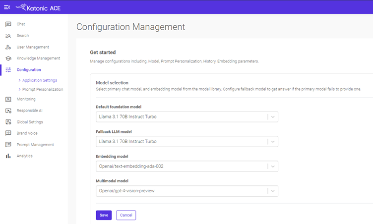

# Image Connector User Documentation

## Overview
The Image Connector is an advanced tool designed to analyze and describe images using a multimodal model. By simply uploading images from your local, this connector processes each image and generates detailed descriptions, capturing key elements and context. Ideal for users who need automated image analysis and descriptive data, the Image Connector streamlines the process of understanding and categorizing visual content.

## Configuration

1. Go to **Configuration** -> **Application settings** -> **Model selection**.
2. Choose a multimodal model to use with the Image Connector.

   

## Usage

- Once you select the multimodal model of your choice, it will be used to generate image descriptions and store them in the database.
- You can then ask questions or search with the data provided in our services, **Ace Search** and **Chat**.

## Supported image file types:

1. JPG
2. JPEG
3. PNG
